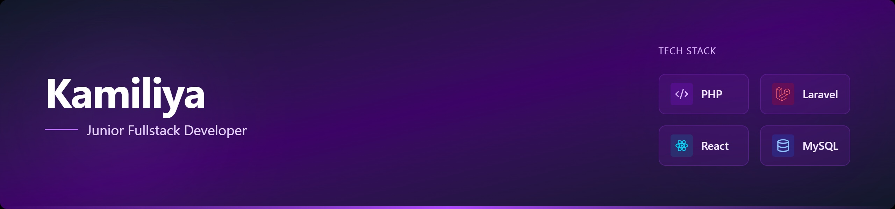

## 👋 Hello World, I'm Kamiliya!

  

  

  

  💻 <b>Junior Fullstack Developer</b> 
  🚀 Passionate about building modern, scalable web applications

---

### 👩‍💻 About Me
- 💼 Part-time Web Developer at **Sonokembang Jakarta**
- 🛠️ Developing web applications for company needs
- 🌱 Currently learning **Laravel & React.js**
- 💡 Passionate about Backend & Fullstack Development
- 🚀 Experienced in building web applications using PHP & MySQL

---

### 🛠️ Tech Stack

  

  

---

### 🚀 Featured Projects
🔹 **Project Laravel App**  
👉 https://github.com/kamiliyap/project-1  

🔹 **PHP Native App**  
👉 https://github.com/kamiliyap/project-php-native  

🔹 **React Frontend App**  
👉 https://github.com/kamiliyap/project-2  

---

### 📈 GitHub Stats

  

---

### 🌐 Connect With Me

  
  

---

### ⚡ Fun Fact
I love turning ideas into real applications and continuously learning new technologies 🚀

  

